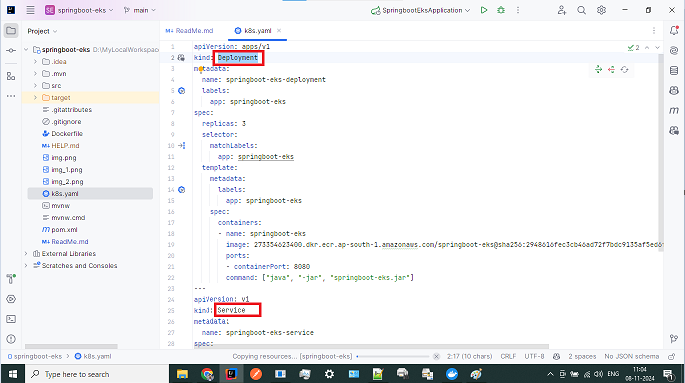
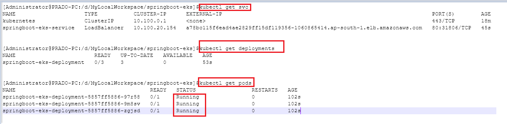
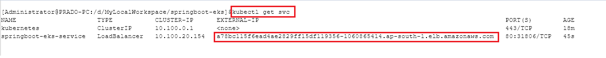
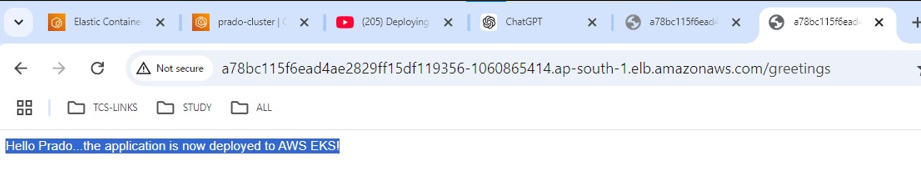

<h1>SpringBoot Application on AWS EKS using ECR</h1>

# Pre-requisites:
* AWS Account
* AWS CLI
* EKSCTL
* Kubectl
* Docker

<h2>

# STEP-1: Build the project:

</h2>

First build the project springboot-eks to generate the .jar under the target folder
* mvn clean install

<h2>

# STEP-2 : Create the Docker image by running the below command at project root directory:

</h2>

* docker build -t springboot-eks .

<h2>

# STEP-3: Verify the image creation via command

</h2>
* docker images
REPOSITORY          TAG         IMAGE ID        CREATED              SIZE
springboot-eks     latest    208429527292   11 seconds ago   567MB

<h2>

# STEP-4: Run the Docker image locally to verify the application is working fine

</h2>

* docker run -p 8080:8080 springboot-eks

<h2>

# STEP-5: Verify the application is running by accessing the below URL in the browser

</h2>
* http://localhost:8080/greetings

<h2>

# STEP-6: Create an ECR repository namely springboot-eks in AWS-CONSOLE and then click on the view push commands
to see how to push the local Docker image in to the AWS ECR repository

</h2>  

<h2>

# STEP-7: Push the Docker image to the AWS ECR via AWS-CLI

</h2>

* aws ecr get-login-password --region us-east-1 | docker login --username AWS --password-stdin 123456789012.dkr.ecr.us-east-1.amazonaws.com

* docker tag springboot-eks:latest 123456789012.dkr.ecr.us-east-1.amazonaws.com/springboot-eks:latest

* docker push 123456789012.dkr.ecr.us-east-1.amazonaws.com/springboot-eks:latest

<h2>

# STEP-8: Create  the EKS CLuster via eksctl in AWS using below command and update the kubeconfig via second command

</h2>

* eksctl create cluster --name prado-cluster --version 1.30.2 --nodes=1 --node-type=t2.small --region ap-south-1

* aws eks --region ap-south-1 update-kubeconfig --name prado-cluster

<h2>

# STEP-9: Create the K8s yaml in ur application as below and have the configuration for the deployment & service

</h2>

* kubectl apply -f k8s.yaml

<h2>

# STEP-10: Verify the deployments & service via the below commands

</h2>

* kubectl get svc
* kubectl get deployments
* kubectl get pods
* kubectl describe pod <podname>

<h2>

# STEP-10: Verify the application end-point by accessing the below URL in the browser

</h2>

* http://<LoadBalancer-URL>/greetings
* http://a78bc115f6ead4ae2829ff15df119356-1060865414.ap-south-1.elb.amazonaws.com/greetings

